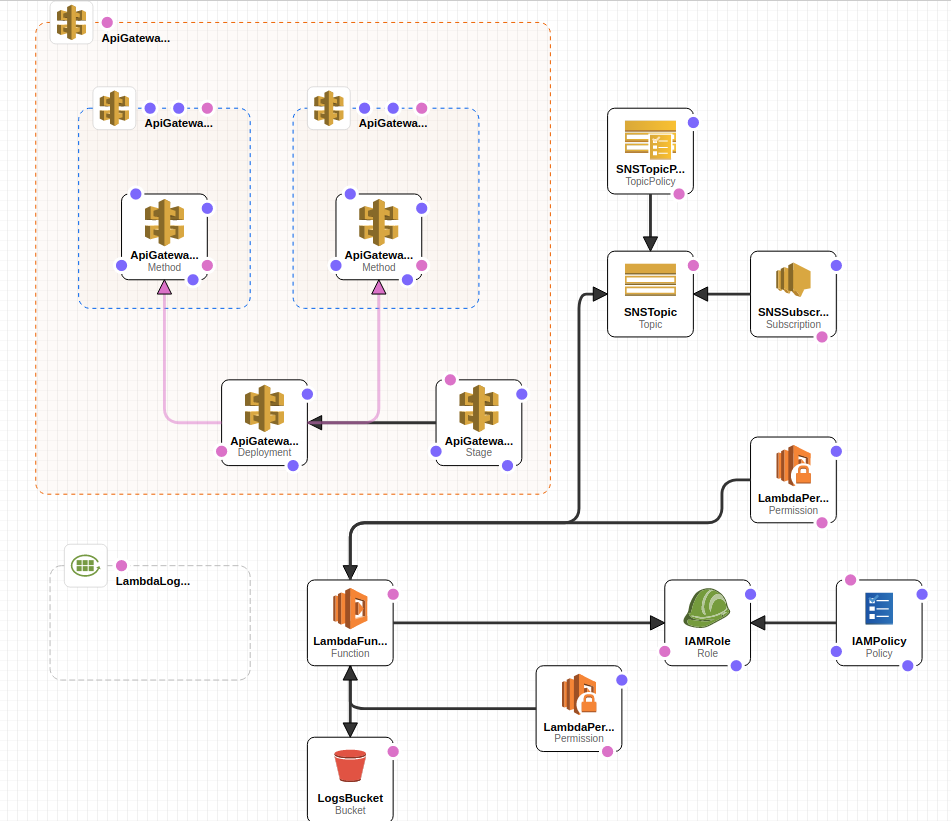
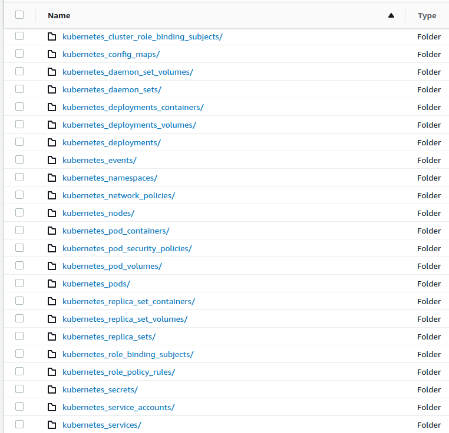
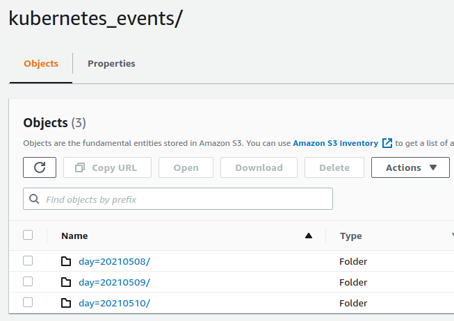
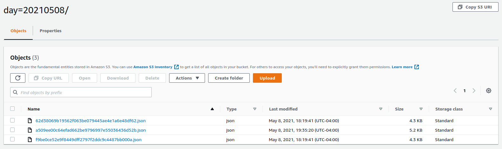

# Query TLS

Generic [Osquery](https://osquery.io) TLS service that can be deployed in AWS as a Lambda function. Lambda supports `enroll` and `log` requests. Osquery agent or its extensions like [kubequery](https://github.com/Uptycs/kubequery), [cloudquery](https://github.com/Uptycs/cloudquery), etc can use this service to capture the log data and optionally create alerts, etc.

### Features
* TLS service as AWS Lambda
* Persist log data to S3 organized by day
* Create rules and alert notifications using [JsonLogic](https://jsonlogic.com)

### Build
* Install [NodeJS](https://nodejs.org/en/) version 12.x or better
* Add/update/remove [rules](rules)
* To run the unit tests: ```npm test```
* Run ```npm package``` to create zip file bundle that can be deployed as Lambda

### Installation

[AWS CloudFormation](cloudformation/query-tls.yml) template can be used to create the necessary AWS resources. CloudFormation template requires 5 parameters:
* `Email`: Email address to send alert notifications to
* `EnrollSecret`: Shared secret that should match the agent side value
* `StorageBucket`: S3 bucket that will be created by CloudFormation where log data is stored
* `LambdaBucket`: S3 bucket where Lambda zip can be deployed from
* `LambdaKey`: S3 key path to the Lambda zip file



CloudFormation creates the following resources:
* AWS ReST API Gateway
* Lambda
* Lambda CloudWatch log group
* IAM role/policy for Lambda
* SNS topic for Lambda to send alerts when rules match
* SNS topic subscription for specified email address
* S3 bucket for saving structured log data

CloudFormation Outputs 3 values that can be used on the agent side to configure Osquery or [basequery](https://github.com/Uptycs/basequery) based extension:

* `EnrollTLSEndpoint`: Should be used for `--enroll_tls_endpoint` flag
* `LoggerTLSEndpoint`: Should be used for `--logger_tls_endpoint` flag
* `TLSHostname`: Should be used for `--tls_hostname` flag

Example `kubequery.flags` file for connecting to the Lambda:
```properties
--extensions_interval=5
--extensions_timeout=5
--schedule_splay_percent=50
--tls_hostname=abcdef.execute-api.us-west-2.amazonaws.com
--tls_server_certs=/opt/uptycs/etc/certs.pem
--enroll_secret_path=/opt/uptycs/config/enroll.secret
--enroll_tls_endpoint=/default/enroll
--logger_plugin=tls
--logger_tls_endpoint=/default/log
--logger_tls_compress=true
```

`EnrollSecret` CloudFormation input parameter value should match the kubequery `enroll.secret` in kubequery YAML.

Once CloudFormation resources are created and Osquery/basequery agent starts sending data, `StorageBucket` should start to accumulate structured log data:







### TODO
* Integration with AWS Glue, Athena, QuickSight
* More unit tests and snapshot result support
* Terraform or other tools support